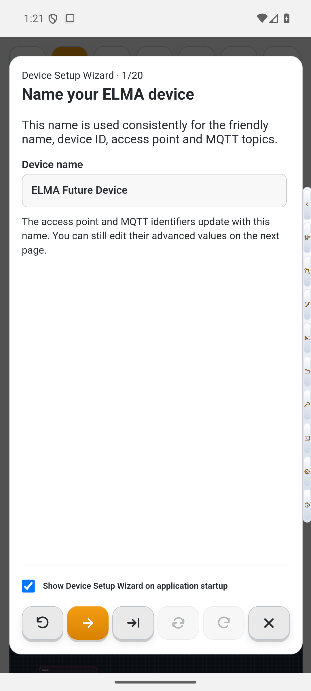
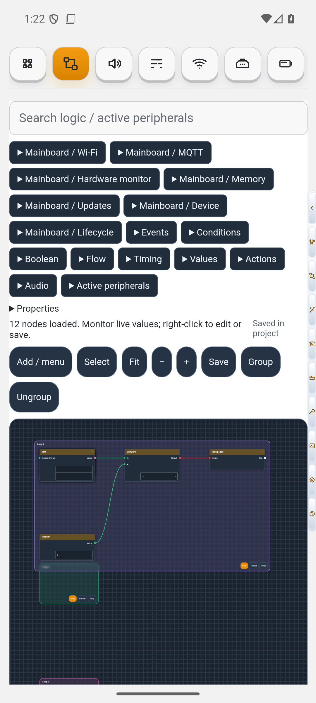

# ELMA-IoT Documentation

This is the public, online-only user documentation for ELMA-IoT. Android, Windows, and the ESP web interface store only stable `helpId` references and open these pages in the default browser.

- [Getting Started](https://elma-iot.github.io/elma-iot-docs/en/getting-started/)
- [First 15 minutes](https://elma-iot.github.io/elma-iot-docs/en/getting-started/first-15-minutes/)
- [Visual Logics](https://elma-iot.github.io/elma-iot-docs/en/logics/overview/)
- [Tutorials](https://elma-iot.github.io/elma-iot-docs/en/tutorials/)
- [Project cookbook](https://elma-iot.github.io/elma-iot-docs/en/cookbook/)
- [MQTT guide](https://elma-iot.github.io/elma-iot-docs/en/mqtt/guide/)
- [Configuration reference](https://elma-iot.github.io/elma-iot-docs/en/configuration/reference/)
- [Troubleshooting](https://elma-iot.github.io/elma-iot-docs/en/troubleshooting/)

ELMA-IoT supports ESP32, ESP32-S3, and ESP32-C3 families, visual peripheral configuration, automatic GPIO assignment, firmware compilation, USB and OTA flashing, MQTT, audio, displays, device monitoring, and a visual automation runtime. Documentation distinguishes configuration/wiring profiles from the smaller set of profiles with implemented firmware runtime adapters.

Current applications:

- Android 1.0.13: setup wizard, vertical constructor, full Blueprint canvas, local compilation, USB and OTA flashing.
- Windows 0.1.57: standalone visual designer and full offline ESP compiler for Windows 10/11 x64.
- Device firmware 0.1.54: live web configuration, Logics monitoring, MQTT, peripherals, and OTA updates.

## Screenshots





More current application screenshots appear throughout [Getting Started](https://elma-iot.github.io/elma-iot-docs/en/getting-started/) and the [tutorials](https://elma-iot.github.io/elma-iot-docs/en/tutorials/).

Documentation is generated from a sanitized feature catalog. It contains no application source, credentials, signing material, private configuration, or compiler artifacts.

## Development

```text
python tools/build_site.py
python tools/validate.py
```

CI validates help IDs, routes, internal links, locale fallbacks, screenshot metadata, and coverage before publishing GitHub Pages.

The planned Custom Hardware Constructor can use the documented [safe documentation-bundle contract](CUSTOM-HARDWARE-DOCUMENTATION.md).

## Versions

Current documentation applies to ELMA-IoT Android 1.0.13+, Windows 0.1.57+, and firmware 0.1.54+, unless an article says otherwise.
